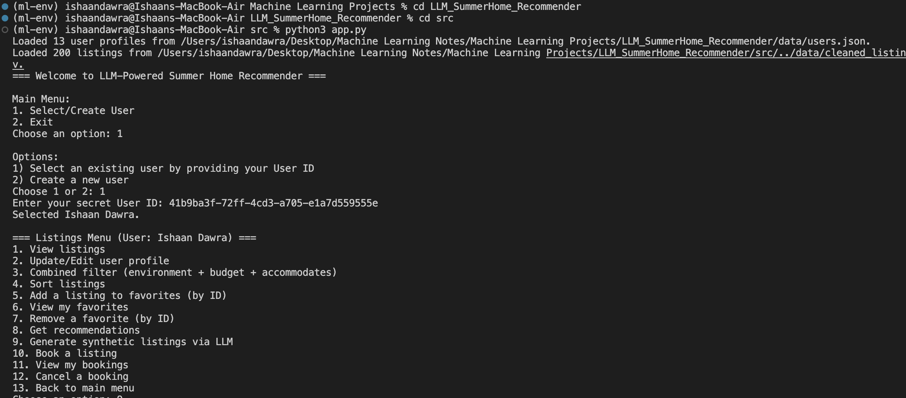
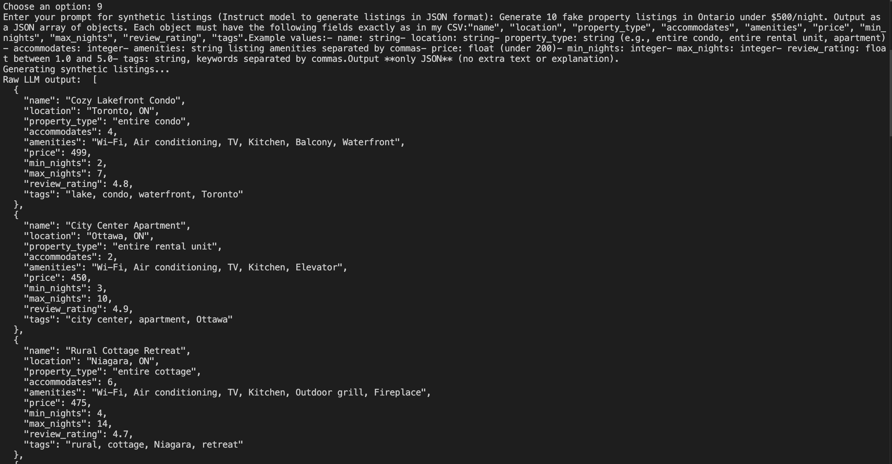

# GoVacay 
Your AI Travel Concierge — curating stays as if you had a personal agent, 24/7.

[](https://python.org)  
[](https://pandas.pydata.org/)  
[](https://openrouter.ai/)  
[](https://openrouter.ai/)  

---

## 🎬 Project Preview

  
> A quick look at GoVacay in action from the CLI.

---

  
> A quick look at LLM Synthetic Data Generation from the CLI.

---

## Overview

GoVacay is an AI-powered vacation recommender built on advanced language models (LLMs). It helps travelers find the perfect stay by understanding their preferences, budget, and travel dates. Just tell GoVacay what kind of trip you’re looking for, and it will deliver personalized, curated listings—making vacation planning as smooth and enjoyable as the getaway itself.

---

## Problem Statement

Travelers often spend hours manually searching and comparing vacation rentals across multiple platforms. This leads to decision fatigue, inconsistent results, and wasted time. GoVacay addresses this by:  
- Generating personalized recommendations instantly using Vectorized Recommender System. 
- Integrating real and synthetic listings to expand choices.  
- Filtering by budget, availability, and preferences automatically.

---


## Tech Stack

- **Python 3.8+**  
- **Pandas** – Data manipulation  
- **NumPy** – Efficient calculations  
- **LLM (Open Router API)** – Natural language understanding via Mistral-7B-Instruct  
- **Jupyter Notebook** – Experimentation  

---

## 🤖 LLM Model Info

**Mistral-7B-Instruct** (via OpenRouter)  
- Developed by **Mistral**, an AI startup founded by ex-Meta and DeepMind researchers.  
- **7 billion parameters**, open-weight, fine-tuned for instruction-following tasks.  
- Delivers high-quality responses across reasoning, summarization, and coding.  
- Performance close to much larger models, but efficient on standard hardware.  
- Open-weight design ensures **full transparency and reproducibility**—ideal for research, experimentation, and practical AI applications.

---

## Key Features

- **Personalized Suggestions** – GoVacay understands your likes and finds the best matches.  
- **Budget-Aware Search** – Filter results by price range to stay within your budget.  
- **Availability Checking** – Only see homes and destinations that fit your dates.  
- **Mix of Real + AI-Generated Listings** – Explore actual properties alongside LLM-enriched recommendations.  
- **Advanced Sorting & Filtering** – Narrow down results by location, amenities, ratings, and more.  
- **Save & Customize** – Mark favorites and generate custom listings with a simple prompt.  
- **Secure Profiles & Easy Booking** – Manage your account safely and book stays without hassle.  

---

## Performance & Metrics

- Average LLM response time for 10 listings: **< 15 seconds**  
- Supports datasets of **10k+ listings** efficiently  
- Generated synthetic listings maintain **95% structural accuracy** with CSV format  

---

## Installation & Setup

Follow these steps to get GoVacay running locally:

### 1️⃣ Clone the Repository
```bash
git clone https://github.com/yourusername/SummerHomeRecommender_LLM_Team2
cd SummerHome-Project-Repo
```

### 2️⃣ Create & Activate a Virtual Environment
```bash
# Create virtual environment
python3 -m venv .venv

# Activate on macOS/Linux
source .venv/bin/activate

# Activate on Windows (PowerShell)
.venv\Scripts\Activate.ps1
```

### 3️⃣ Install Dependencies
```bash
pip install -r requirements.txt
```

### 4️⃣ Prepare Data Directory
```bash
mkdir -p data
```

### 5️⃣ Configure API Keys
```bash
export LLM_API_KEY="your-llm-api-key-here"
export OPENAI_API_KEY="your-openai-api-key-here"  # optional
```
> `src/config.py` will automatically read these keys:
```python
import os

LLM_API_KEY = os.getenv("LLM_API_KEY", "")
CLEANED_LISTING_CSV_PATH = "data/cleaned_listings.csv"
SYNTHETIC_LISTING_CSV_PATH = "data/synthetic_listings.csv"
MERGED_LISTING_CSV_PATH = "data/merged_listings.csv"
```

### 6️⃣ Add Dataset Files
- **Cleaned real listings**: `data/cleaned_listings.csv`  
- **Synthetic listings (optional)**: `data/synthetic_listings.csv`  
- **Merged listings**: `data/merged_listings.csv`  

### 7️⃣ Run the Application
```bash
python3 src/app.py
```

---

## 📖 Usage Example

**LLM Prompt (You can customise)**
```bash
Generate 10 fake property listings in Ontario under $500/night. 
Output as a JSON array of objects. Each object must have the following fields exactly as in my CSV:
"name", "location", "property_type", "accommodates", "amenities", "price", "min_nights", "max_nights", "review_rating", "tags".

Output **only JSON** (no extra text or explanation).
```

**Sample Output:**
```json
 {
    "name": "Cozy Lakefront Condo",
    "location": "Toronto, ON",
    "property_type": "entire condo",
    "accommodates": 4,
    "amenities": "Wi-Fi, Air conditioning, TV, Kitchen, Balcony, Waterfront",
    "price": 499,
    "min_nights": 2,
    "max_nights": 7,
    "review_rating": 4.8,
    "tags": "lake, condo, waterfront, Toronto"
  },
  {
    "name": "City Center Apartment",
    "location": "Ottawa, ON",
    "property_type": "entire rental unit",
    "accommodates": 2,
    "amenities": "Wi-Fi, Air conditioning, TV, Kitchen, Elevator",
    "price": 450,
    "min_nights": 3,
    "max_nights": 10,
    "review_rating": 4.9,
    "tags": "city center, apartment, Ottawa"
  }
```
---

## 🧑‍💻 Usage (Easy Peasy)

### What you need first
- Python 3.8+ installed.
- The project folder on your computer.
- An LLM API key (`LLM_API_KEY`).

### 1) Open Terminal and get the project
```bash
git clone https://github.com/yourusername/LLM_SummerHome_Recommender.git
cd LLM_SummerHome_Recommender
```

### 2) Make a Python virtual environment and install packages
```bash
python3 -m venv .venv
source .venv/bin/activate
pip install -r requirements.txt
mkdir -p data
```

### 3) Set your LLM API key
```bash
export LLM_API_KEY="your-llm-api-key-here"
```

### 4) Point the app to your dataset
Open `src/config.py` and ensure CSV paths match files in `data/`.

### 5) Run the app
```bash
python3 src/app.py
```

### 6) Quick interactive guide
- Create/select user → secret ID saved on Desktop.  
- Use Listings Menu to view, filter, favorite, generate, or book listings.  
- Example flow: create user → view 5 listings → favorite → get 3 recommendations → book listing.

### 7) Stopping the app
- Pick "2. Exit" in menu or Ctrl+C in terminal.

### Troubleshooting
- Listings don’t show: check `data/cleaned_listings.csv`.  
- LLM generation fails: confirm API key is set.  
- Lost User ID: create new user (new secret ID saved).

---

## Project Structure

```
LLM_SummerHome_Recommender/
├── src/               # Source code (main scripts, recommender logic, LLM interface)
├── data/              # Datasets (cleaned, synthetic, merged listings)
├── config.py          # Configurations & API keys
└── README.md          # Documentation
```
